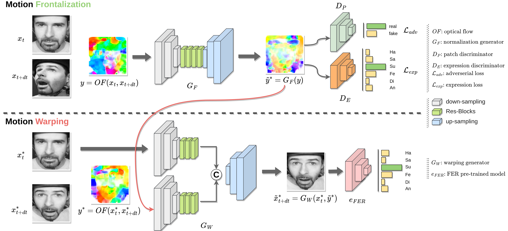
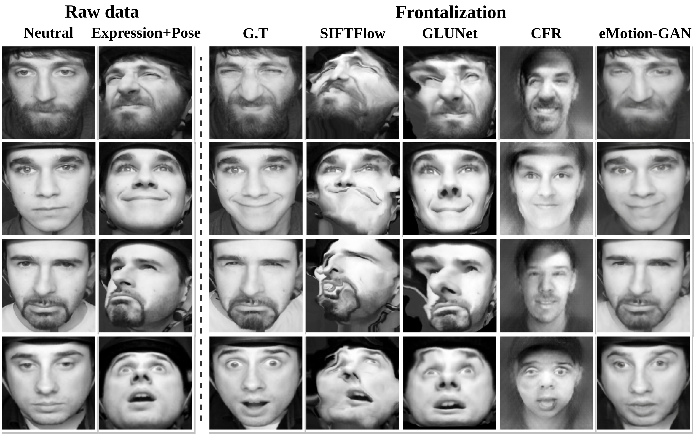
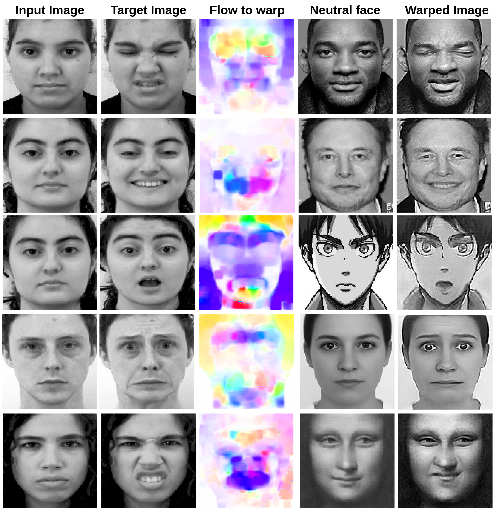

# eMotion-GAN

### [[Colab Demo](https://colab.research.google.com/drive/1KTyN7DJnI5P_1HMoEiSBmw-IWWkCR5Jc?usp=sharing) 😀]
This repository contains the source code for our paper:

**eMotion-GAN: A Motion-based GAN for Photorealistic and Facial Expression Preserving Frontal View Synthesis**



[]([VIDEO_URL](https://imtcast.imt.fr/video/5397-emotion-gan-supplementary-video/))

Check out our **[Supplementary Video](https://imtcast.imt.fr/video/5397-emotion-gan-supplementary-video/)** for more details & results. 

**Animation:**


## **Updates**
- ...

## **Installation**
Create and activate conda environment:
```
conda create -n eMotionGAN python=3.10
conda activate eMotionGAN
```

Install all dependencies:
```
pip install -r requirements.txt
```

Install Jupyter Lab to visualize demo:
```
conda install -c conda-forge jupyterlab
```

Download the pre-trained weights file from [Google Drive](https://drive.google.com/file/d/1jnEIj0XQ5YA23HDItuF0gXMO-0UWTFK8/view?usp=drive_link). Move it to the `./weights` folder.

### Demos

Run our interactive visualization [demo](https://colab.research.google.com/drive/1KTyN7DJnI5P_1HMoEiSBmw-IWWkCR5Jc?usp=sharing) using Colab notebook (no GPU needed).


### Frontal View Synthesis (FVS) & Facial Expression Preserving 


### Cross-subject Facial Motion Transfer



## Training

By default, the training datasets are structured as follows:
```
├── datasets

    ├── CK+
        ├── sub_id
            ├── seq_id
              ├── img_001.png
              ├── img_002.png
              ...
              ├── img_010.png
              
    ├── ADFES
        ├── sub_id
            ├── seq_id
              ├── img_001.png
              ├── img_002.png
              ...
              ├── img_010.png
              
    ...
```
    
### Motion Calculation

```
python generate_data_files.py --dataset_name SNAP
                              --data_dir_F ./datasets/SNAPcam1/ 
                              --data_dir_NF ./datasets/SNAPcam2 
                              --save_dir_F ./datasets/optical_flows/ 
                              --save_dir_NF ./datasets/optical_flows/ 
                              --emotions_file_path ./datasets/emotions/SNAP_emotions.csv 
                              --flow_algo Farneback
```

### Training

Download [DMUE](https://github.com/JDAI-CV/FaceX-Zoo/tree/main/addition_module/DMUE) and its pre-trained model.

```
python train.py --data_path ./datasets/data_file.txt 
                --proto_path ./datasets/protocols/SNAP_proto.csv 
                --fold 1
```

## Evaluation

### Frontal View Synthesis
```
python FVS_demo.py --img1 images/images_1.png 
                   --img2 images/images2.png
                   --model_path weights/eMotionGAN_model.pth
```

### Motion Transfer
```
python motion_transfer_demo.py --img1 images/images_1.png 
                               --img2 images/images2.png 
                               --neutrl_img images/neutral_img.png
                               --model_path weights/eMotionGAN_model.pth
```


## Citation
If you find this repo useful, please consider citing our paper

```
@article{ikne2024emotion,
  title={eMotion-GAN: A Motion-based GAN for Photorealistic and Facial Expression Preserving Frontal View Synthesis},
  author={Ikne, Omar and Allaert, Benjamin and Bilasco, Ioan Marius and Wannous, Hazem},
  journal={arXiv preprint arXiv:2404.09940},
  year={2024}
}
```

